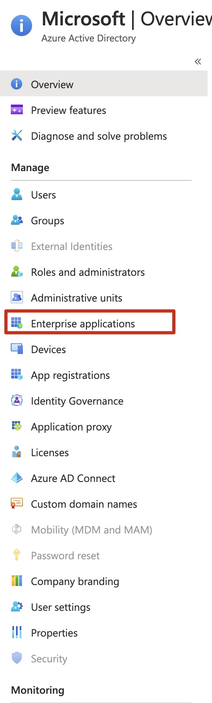
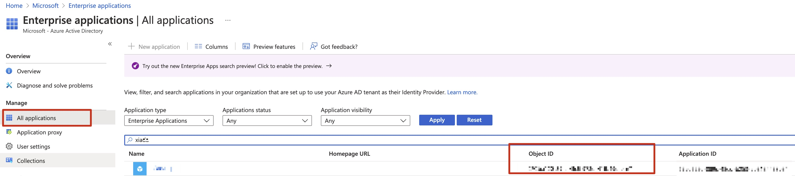

# Spring Cloud Azure 4.0 Sample
This sample is used to demonstrate how to use the Spring Cloud for Azure 4.0 starter. It contains two parts, the first part is to use Terraform to provision Azure resources and the second is to use the starter to try with Service client beans auto-configuration.

## Provision the Resources
Before running terraform, there're two parameters needed to be updated in the `./terraform/variables.tf` file. 

```hcl
variable "application_name" {
  type        = string
  description = "The name of your application"
  default     = "<your-alias>-sample"
}

variable "service_principal_id" {
  type        = string
  description = "The Azure Service Principal id or object_id to assign role to"
  default     = ""
}
```
You could refer to [this](#known-issues) to find the service principal id.

After this you could run the terraform commands to provision resources.

- Install [Terraform](https://www.terraform.io/) for your platform.
- Install the [Azure CLI](https://aka.ms/nubesgen-install-az-cli) and authenticate using `az login`
- In the terraform directory, initialize Terraform: `terraform init`
- Apply the current Terraform configuration: `terraform apply`

```shell

cd terraform

# Login to azure-cli
az login
az account set --subscription <your-subscription-id>

# 
terraform init
terraform apply
```

### Create data plane role assignment for Cosmos to service principal or user
```shell
accountName='your-cosmos-account-name'
resourceGroupName='your-resource-group'

# List data plane role definitions
az cosmosdb sql role definition list --account-name $accountName --resource-group $resourceGroupName

# Create role assignment
subscriptionId='your-subscripiton-id'
principalId='the-principal-id-of-the-user-or-service-principal'
contributorRoleDefinitionId='/subscriptions/'$subscriptionId'/resourceGroups/'$resourceGroupName'/providers/Microsoft.DocumentDB/databaseAccounts/'$accountName'/sqlRoleDefinitions/00000000-0000-0000-0000-000000000002'

az cosmosdb sql role assignment create --account-name $accountName --resource-group $resourceGroupName --scope "/" --principal-id $principalId --role-definition-id $contributorRoleDefinitionId
```
Check [here](#known-issues) for more information.


## Copy the outputs from Terraform to Your IDE or Environment
```shell
# Make sure jq is installed before you run this command

 terraform output -json | jq -r '
  . as $in
  | keys[]
  | ($in[.].value | tostring) as $value
  | ($in[.].sensitive | tostring) as $sensitive
  | [
    (. | ascii_upcase) + "=" + $value
    ]
  | .[]'  
  
```

```shell
# Windows command
terraform output -json | jq -r ". as $in | keys[] | ($in[.].value | tostring) as $value | ($in[.].sensitive | tostring) as $sensitive | [ (. | ascii_upcase) + \"=\" + $value ] | .[]"
```

## Run the Sample Application

There are three profiles defined in this application, `default`, `credential-sp`, and `credential-other`.

- The `default` profile will try to leverage your local developing environment, such as your credential stored in Intellij, VS Code, Azure CLI, Azure Powershell, etc.
- The `credential-sp` profile requires a service principal, which is the same service principal you configured in the terraform variables.
- The `credential-other` profile tries to use credentials other than a token credential, such as SAS token or access key.

Make sure you specify the corresponding profile before running the application.

## Clean up the resources

```shell
terraform destroy
```

## Known issues

<details>
  <summary>How to find the service principal id?</summary>
  
  The service principal id is the `Object Id` you could find from the portal by:
  
  `Azure Active Directory` --> `Enterprise applications` --> `App applications`, and then search your service principal created before. 
  
  
  
  
</details>

<details>
  <summary>Why do I need to manually add the role assignment of Cosmos?</summary>  
  
  If you're accsing the Cosmos DB using a service principal or your signed-in user credential, you need to assign data plane role assignment to either your service pricipal or the user. 
  https://github.com/MicrosoftDocs/azure-docs/blob/master/articles/cosmos-db/how-to-setup-rbac.md#concepts. 
  
  However to configure such data plane role assignment is not supported [via Azure Portal](https://github.com/MicrosoftDocs/azure-docs/blob/master/articles/cosmos-db/how-to-setup-rbac.md#is-it-possible-to-manage-role-definitions-and-role-assignments-from-the-azure-portal) or [using terraform](https://github.com/hashicorp/terraform-provider-azurerm/issues/10817). So now we need to create such role assignments via CLI, Powershell, or ARM template.
</details> 

<details>
  <summary>How to add more terraform modules for other Azure resouces?</summary>  
  
  With knowledge of these two components [terraform-provider-azurecaf](https://github.com/aztfmod/terraform-provider-azurecaf) and [terraform-provider-azurerm](https://github.com/hashicorp/terraform-provider-azurerm) will help you easily write your own terraform scripts. The `terraform-provider-azurecaf` is used to create names for Azure resouces, and the `terraform-provider-azurerm` is used to define the actual resouces. 

- Refer to this [reference](https://registry.terraform.io/providers/hashicorp/azurerm/latest/docs) to learn the supported arguments and output of each resource type.
- Use Visual Studio Code and install the [Terraform](https://marketplace.visualstudio.com/items?itemName=HashiCorp.terraform) and [Azure Terraform](https://marketplace.visualstudio.com/items?itemName=ms-azuretools.vscode-azureterraform) extensions.
- Refer to https://github.com/aztfmod/terraform-provider-azurecaf to see [supported resources](https://github.com/aztfmod/terraform-provider-azurecaf#resource-status).
- Refer to https://github.com/hashicorp/terraform-provider-azurerm to see whether is a feature supported.
</details> 


<details>
  <summary>Fail to provision storage after destroy</summary>  
  
  https://github.com/hashicorp/terraform-provider-azurerm/issues/7880
  
  If you run `terraform apply` immediately after `terraform destroy`, it will complain the storage container can't be found. Just wait a couple minutes to run `terraform apply` will solve this problem.
</details> 

<details>
  <summary>SOLVED -- Why the terraform can't run on Apple M1?</summary>  
  
  `terraform-provider-azurecaf` doesn't have a darwin_arm64 package now. https://github.com/aztfmod/terraform-provider-azurecaf/issues/95
</details>  


